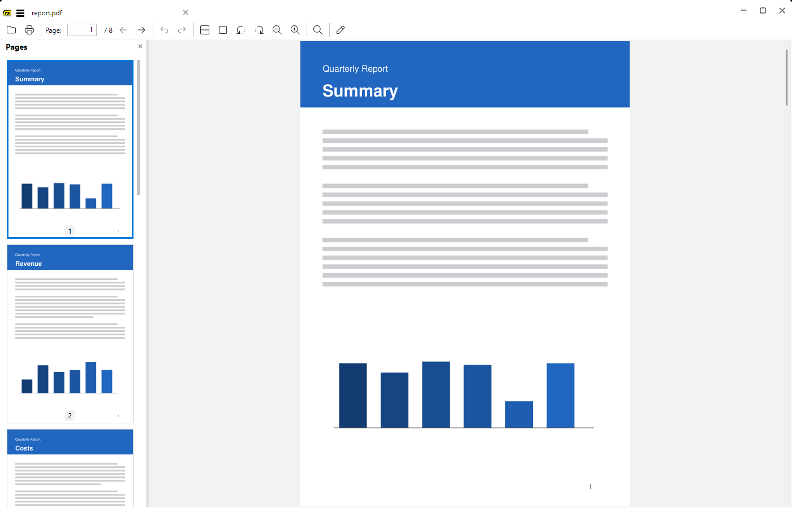
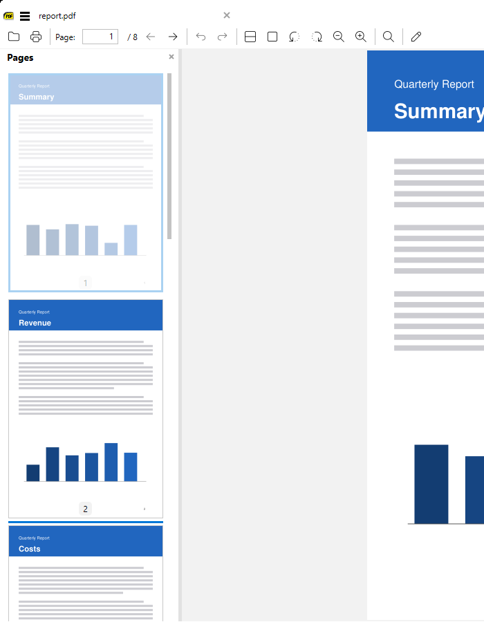
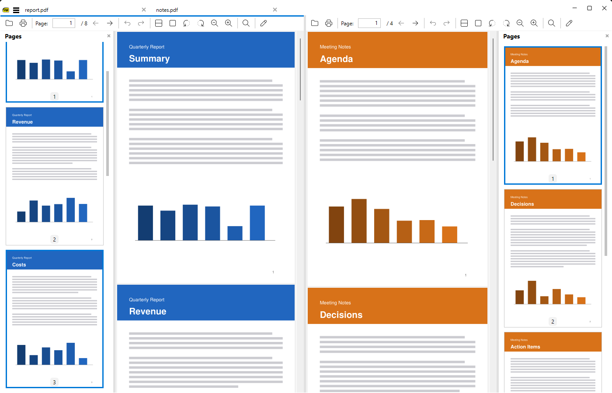
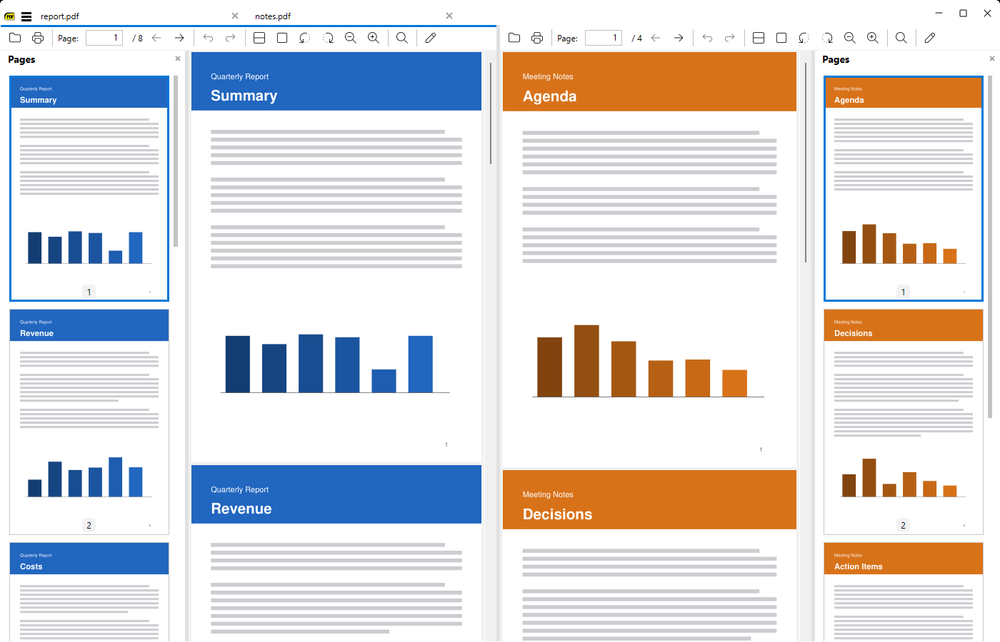
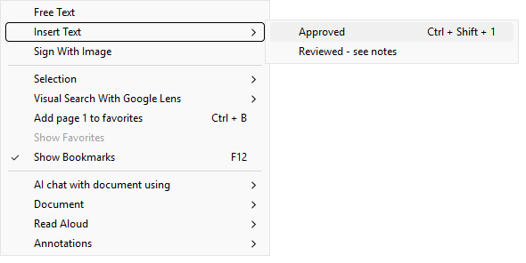

[](https://github.com/DubMak/sumatrapdf-tweaks/actions/workflows/tweaks-build.yml)

# SumatraPDF Tweaks

A personal fork of [SumatraPDF](https://github.com/sumatrapdfreader/sumatrapdf) that turns it into a light PDF page
organizer: page thumbnails, drag-and-drop page reordering, merging PDFs, two documents side by side, plus a few
annotation shortcuts.

All changes live on the `my-tweaks` branch. Everything else is upstream SumatraPDF.

## Download

Get the [latest release](https://github.com/DubMak/sumatrapdf-tweaks/releases/latest) (every change is published there
automatically, no login needed):

- `SumatraPDF-tweaks-<N>-64-install.exe`: the installer
- `SumatraPDF-tweaks-<N>-64.exe`: portable, runs without installing

64-bit Windows only. Builds are unsigned, so Windows SmartScreen may warn on first run.

> **Turn off update checks.** SumatraPDF's updater points at the official releases; installing one replaces this fork.
> In _Settings > Advanced Options_ set `CheckForUpdates = false`.

## What's different

### 1. Pages sidebar

The sidebar gets a **Bookmarks | Pages** toggle. **Pages** shows a thumbnail of every page:

- click a thumbnail to go to that page; the current page is outlined in blue
- scrolls smoothly and shows partly visible pages
- works for every document, including ones with no bookmarks



### 2. Reorder pages by dragging

Press on a thumbnail and drag it. The page fades, and a blue line shows where it will land. Drop to move the page.

- the view, thumbnails, bookmarks and links follow the new order
- **Ctrl+Z / Ctrl+Y** undo and redo a move
- **Ctrl+S** (new **Save** command) writes the change back to the PDF; with nothing to save it acts as _Save As_



### 3. Select several pages

| Action           | Result                                           |
| ---------------- | ------------------------------------------------ |
| Click            | select one page and go to it                     |
| Ctrl+click       | add or remove a page, pages need not be adjacent |
| Shift+click      | select a range from the last clicked page        |
| Ctrl+Shift+click | add a range to the selection                     |

Drag any selected page to move the whole selection; the pages keep their order and land together. The drag shows a
count badge. One undo reverts the whole move.



### 4. Insert pages from other PDFs

Drag PDF files from Explorer onto the Pages sidebar. A line marks the drop spot; dropping inserts every page of each
file there (one undo step per file).

- annotations and form fields of the inserted pages are flattened into the page so they survive; the dropped file
  isn't modified
- dropping anywhere else, or dropping non-PDF files, opens them as usual

### 5. Split view: two documents side by side

Ways to open a second document next to the current one:

- **Ctrl+\\** (or **Toggle Split View** in the command palette) toggles split view
- right-click a tab > **Split With Current Tab**, or the current tab > **Split View**
- **Ctrl+click** a tab
- drag a tab onto the left or right half of the document (the drop side is highlighted)
- drop one PDF from Explorer onto the right third of the document

- each side has its own toolbar, Pages sidebar (on its outer edge), zoom, page and undo
- a colored line on the toolbar marks the side with keyboard focus; shortcuts such as Ctrl+S act on that side
- **Ctrl+Tab / Ctrl+Shift+Tab** switch tabs from either side
- end it with **Ctrl+\\**, **Close Split View** (tab menu or command palette) or by closing either tab



### 6. Copy pages between documents

In split view, drag thumbnails (one page or a multi-selection) from one side's Pages sidebar onto the other's. The
pages are **copied** into that document at the drop line, and the copies are selected. Unsaved edits of the source
pages come along. One undo step removes them.

Combined with Ctrl+S this merges and splits PDFs without another tool.

### 7. Delete and export pages

- **Delete**: click a thumbnail (or select several), press **Delete** (or right-click > **Delete Page**). Ctrl+Z brings the pages back; Ctrl+S saves the
  change. The last page can't be deleted.
- **Save pages to a new PDF**: right-click a thumbnail > **Save Page As...** (or **Save N Pages As...** for a
  selection) and pick a name.
- **Drag to Explorer**: drag thumbnails out of the window onto a folder or the desktop. The pages are saved there as a
  new PDF named like `report - pages 3-5.pdf`; rename it in Explorer if you like. (Explorer doesn't tell the app which
  folder it was dropped on, so a drop can't open a Save As dialog; use the right-click command to choose the name
  first.)

Exports include unsaved edits (reordering, annotations); the open document isn't changed.

### 8. Annotation shortcuts

Right-click a page:

- **Free Text** is first. In _Edit PDF_ mode the box starts empty with its format toolbar open; an empty box is removed
  when you click away.
- **Sign With Image** stamps your signature image immediately, no file picker.
- **Insert Text** inserts predefined text snippets (a single snippet shows as its own item; several get a submenu).
  Snippets can have a keyboard shortcut.



In _Edit PDF_ mode, the arrow keys nudge the selected annotation by a pixel (Shift+arrow: 10 pixels).

## Different defaults

- Free Text is red (`FreeTextColor = #ff0000`) with no border (`FreeTextBorderWidth = 0`).
- `SignatureImage` is `c:\sig\signature.png`.
- A fresh install gets one text snippet, **Invoice approvals** (Producer and Accountant approval lines).
- No Home tab (`NoHomeTab = true`), and Ctrl+Tab switches tabs directly (`CtrlTabSimple = true`).
- No update checks (`CheckForUpdates = false`): the official updater would replace this fork.

Change any of these in the settings file; an existing settings file keeps its values.

## New settings

Add these in _Settings > Advanced Options_ (`SumatraPDF-settings.txt`):

```
AlwaysShowSidebar = true

Annotations [
	SignatureImage = C:\path\to\signature.png
]

TextSnippets [
	[
		Name = Approved
		Text = Approved\nJ. Doe
		Key = Ctrl+Shift+1
	]
	[
		Name = Reviewed
		Text = Reviewed - see notes
	]
]
```

| Setting                      | Effect                                                                 |
| ---------------------------- | ---------------------------------------------------------------------- |
| `AlwaysShowSidebar`          | open every document with the sidebar shown, even if it was last hidden |
| `Annotations.SignatureImage` | image (e.g. a transparent .png) that **Sign With Image** stamps        |
| `TextSnippets`               | `Name` in the menu, `Text` to insert (`\n` = new line), optional `Key` |

## Building

Same as upstream: see [Developer Information](https://www.sumatrapdfreader.org/docs/Contribute-to-SumatraPDF).
[`.github/workflows/tweaks-build.yml`](.github/workflows/tweaks-build.yml) builds the 64-bit Release exe and installer on
every push to `my-tweaks` and publishes them as release `build-<N>`; tags `v*` get a release under that name.

---

## About SumatraPDF

SumatraPDF is a multi-format (PDF, EPUB, MOBI, CBZ, CBR, FB2, CHM, XPS, DjVu) reader for Windows under (A)GPLv3
license, with some code under BSD license (see AUTHORS).

- [Website](https://www.sumatrapdfreader.org/free-pdf-reader)
- [Manual](https://www.sumatrapdfreader.org/manual)
- [Developer Information](https://www.sumatrapdfreader.org/docs/Contribute-to-SumatraPDF)
